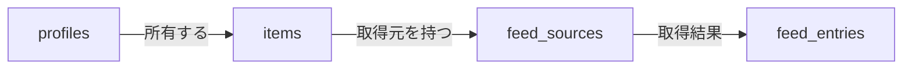

:::message
2作目のポートフォリオとして「Hubpin」（分散した発信を1か所に集めるハブサイト）を作りながら書いています。

- リポジトリ: https://github.com/Matsutake29/hubpin
- Next.js（App Router） + Supabase + Tailwind CSS

`/[username]` が公開ページ、`/dashboard` が編集画面、という構成です。
:::

これから追加するテーブルの RLS を設計していて、いったん考えて、やめた話です。
**テーブル自体はまだ作っていません**（設計判断の記録なので、動作報告ではありません）。
記事の後半に出てくる `items` と `profiles` のほうは、すでに動いている実物です。

## 1行で書けなくなった

これまで書いてきた RLS のポリシーは、全部この形で済んでいました。

```sql
using (auth.uid() = user_id)
```

テーブルが所有者の列を自分で持っているので、ログイン中のユーザーと突き合わせれば終わります。
簡単なものだと思っていました。

今回追加するテーブルは、所有者の列を持っていません。

```sql
-- 親: どのカードがどこから取得するか
create table feed_sources (
  id uuid primary key,
  item_id uuid not null references items(id),   -- カード
  user_id uuid not null references profiles(id) -- 所有者を直接持つ
);

-- 子: 取得結果
create table feed_entries (
  id uuid primary key,
  source_id uuid not null references feed_sources(id),
  title text not null,
  url text not null
);
```



公開フラグ `visible` は `items` に、所有者 `user_id` は `feed_sources` にあります。
`feed_entries` はそのどちらも持っていません。

`feed_entries` から所有者を知るには、`feed_sources` を1段辿る必要があります。
ポリシーが `exists (select 1 from ...)` になって、素直に読めません。

そこで考えたのが、**所有者の ID を子テーブルにも持たせれば1行に戻せるのでは**、というものでした。

## 持たせても辿りは消えなかった

`feed_entries` に `user_id` を足すと、ログイン中のユーザー向けは確かに1行になります。

```sql
-- authenticated 向け: これは1行で書ける
using (auth.uid() = user_id)
```

問題は未認証（`anon`）向けのほうでした。

公開ページに出す条件は「**そのカードが公開されているか**」であって、「誰のものか」ではありません。
公開フラグは `items.visible` にあるので、`feed_entries` が `user_id` を持っていても判定に使えません。

```sql
-- anon 向け: user_id を足しても、結局これになる
using (exists (
  select 1 from feed_sources fs
  join items i on i.id = fs.item_id
  where fs.id = feed_entries.source_id and i.visible = true
))
```

辿りは消えませんでした。消えないうえに、非正規化した `user_id` は `feed_sources.user_id` と
ずれる可能性が出ます（親の所有者が変わったときに同期が要る）。

**持たせて増えるのは「1行で書ける条件」であって、「辿らなくて済む条件」ではなかった**、
というのが自分の理解です。条件ごとに、どの列を見ているかが違うので。

## 足さないことにした

テーブル定義は素直な形のまま、ポリシー側で辿ることにしました。

```sql
-- anon: 公開カードにぶら下がるエントリーだけ
create policy "feed entries of visible items are viewable by anon"
  on feed_entries for select to anon
  using (exists (
    select 1 from feed_sources fs
    join items i on i.id = fs.item_id
    where fs.id = feed_entries.source_id and i.visible = true
  ));

-- authenticated: 自分のものだけ（こちらは1段でよい）
create policy "users can view own feed entries"
  on feed_entries for select to authenticated
  using (exists (
    select 1 from feed_sources fs
    where fs.id = feed_entries.source_id and fs.user_id = auth.uid()
  ));
```

## ロール指定を省くと PUBLIC になる

上の2本には `to anon` / `to authenticated` を付けています。ここは省けません。

PostgreSQL の `CREATE POLICY` のドキュメントに、2つ並べて書いてあります。

> All permissive policies which are applicable to a given query will be combined together using the Boolean "OR" operator.

> The default is `PUBLIC`, which will apply the policy to all roles.

つまり `to` を省くと**全ロールに適用され**、同じテーブル・同じコマンドのポリシーは
**OR で足し算されます**。用途で分けたつもりでも、ロールで分かれていなければ、
ログイン中は両方の条件が有効になります。

### 実際に踏んだ（items）

これは1度踏んでいます。`items` に「公開カードは誰でも」と「自分のカードは本人だけ」を
両方ロール指定なしで書いたときです。

```sql
-- 修正マイグレーションに残したコメント
-- ログイン中は (visible = true) OR (auth.uid() = user_id) になり、
-- 他人の公開カードまで見えていた
```

ログインすると、他人の公開カードまで見えていました。
公開ページ側は `anon` で読んでいるので、**ログインしているときだけ穴が開く**という出方でした。

### 踏む前に直した（profiles）

その10日後、`profiles` のポリシーも同じ形（ロール指定なし）で残っているのに気づきました。

⚠️ **ただしこちらは、その時点では穴が開いていませんでした。**
`profiles` の `select` ポリシーは1本しかなく、OR で結合する相手がいなかったからです。

```sql
create policy "profiles are viewable by anon and authenticated"
  on public.profiles for select
  to anon, authenticated
  using (true);
```

動作は1ミリも変わらない修正です。直したのは「ロール指定が無い」という記述のほうでした。
**1本のうちは無害で、2本目を足した瞬間に開く**——という状態だったので、
足す前に直しておいた、という判断です。

### 2本に分けるか、1本で両ロールを指定するか

`items` は2本、`profiles` は1本になりました。分かれ方の基準はロールの数ではなく、
**条件が同じかどうか**でした。

| | ロールごとの条件 | 書き方 |
|---|---|---|
| `items` | `anon` は `visible = true` ／ 本人は `auth.uid() = user_id` | **違うので2本** |
| `profiles` | どちらも全行（`true`） | **同じなので `to anon, authenticated` で1本** |

`profiles` を `to anon` だけにすると、ログイン中が自分の profile を読めなくなり、
ダッシュボードのヘッダーが壊れます。**「公開ページ用だから anon」ではなく、
そのロールで実際に読む画面があるか**で決める必要がありました。

## 検証は不変量で見る

RLS は「ポリシーが書けた」では確認になりません。書けても効いていないことがあるので、
**非公開のものが0件であること**を直接数えるつもりでいます。

```sql
begin;
  set local role anon;
  select count(*) = 0 as ok
  from feed_entries fe
  join feed_sources fs on fs.id = fe.source_id
  join items i on i.id = fs.item_id
  where i.visible = false;
  -- 期待: t
rollback;
```

`feed_entries` はまだ作っていないので、この検証もこれから通すものです。
実際に書いてみて違いが出たら、追記します。
